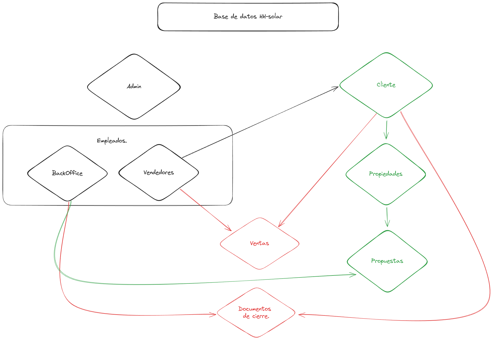

# proposal-hhsolar

Esto es una propuesta inicial basado en las necesidades expresadas por el equipo de Luis Santiago. Por ahora no es definitiva.

Uno de los problemas principales que se enfrenta al llevar a digital los procesos de una empresa, es que se tiende a usar gran cantidad de plataformas para resolver las necesidades especificas que cada proceso tiene. Rara vez se encuentra una plataforma hecha a la medida de una empresa.

Debido a esto, se recomienda siempre el uso de un espacio centralizado (Estilo CRM) diseñado específicamente para manejar las peculiaridades de cada uno de los procesos y las necesidades únicas que presenta cada empresa.

En este caso mi primer borrador presenta las siguientes necesidades:

1. Recursos Humanos.
2. Cotizaciones
3. Datos del cliente.
4. Datos de los consultores.

## integridad de los datos:

Por seguridad se recomienda usar una base de datos relacional con control de acceso mediante autorizacion. Zoho es plenamente capaz de mantener este servicio, sin embargo, como medida de seguridad se recomienda usar una base de datos paralela que funcione incluso de entrada a los datos de zoho, de esta manera se pueden agregar validaciones propias a la data.

## Estructura de la db:

La base de datos tendria los siguientes modelos:

1. Admin
2. Empleados:

- backoffice
- vendedores

3. cliente:

- propiedades
- propuestas

4. ventas -> que se relacionan con vendedores y clientes.
5. documentos de cierre -> que se relacionan con backoffice, clientes y propuestas.
   

## Proposito:

Agrupar todos los procesos en una aplicacion nueva, que se enlace y centralice los demas sistemas, tiene los siguientes objetivos:

1. Guiar de forma clara los procesos de venta, desde el ingreso del cliente, hasta la instalación final.
2. Facilitar el trabajo a los consultores y al equipo de venezuela.
3. Proteger la data y mantener su integridad entre los diferentes sistemas que se usen.
4. Mantener una copia de seguridad de toda la data existente.

## Software:

1. Ruby on Rails para el backend.
2. React + typescript para el frontend.
3. Digital Ocean para deployment, hosting de la app, de la base de datos y backup diario o semanal.
4. Firebase para guardar documentos.
5. mysql como servidor de la base de datos.
6. Zoho voice o Zadarma para llamadas y registros de llamadas.
7. Zoho como crm principal.
8. Sunrun One (para cotizaciones, desconocemos si tiene una API en este momento )

### Nota:

Se recomienda el uso de gmail workspace para los correos corporativos, suele ser una mejor opción que zoho mail y permite un mayor control sobre la actividad de los usuarios. El tema es que también tiene un costo mayor, rondando los 10$ por correo al mes.

## Tiempo de desarrollo:

Para una aplicación completa que integre todos estos elementos de forma adecuada y tenga una buena interfaz de usuario, se estiman al menos unos 3 meses y medio de desarrollo total.

Para una aplicacion minima viable que permita empezar a cotizar y cerrar casos con su conexión a zoho y sunrun one (por definir), el tiempo es mucho mas breve, aproximadamente unas 4 a 5 semanas.

De todos modos, zoho provee un sistema lo suficientemente seguro y completo para manejar la mayoria de las actividades presentes dentro de la empresa, solo habria que verificar si el costo es aceptable o es necesario buscar otras opciones.

La existencia de una aplicación extra, es para cotizar a mayor velocidad y validar la data antes de que esta entre dentro de zoho y dentro de la base de datos extra.
